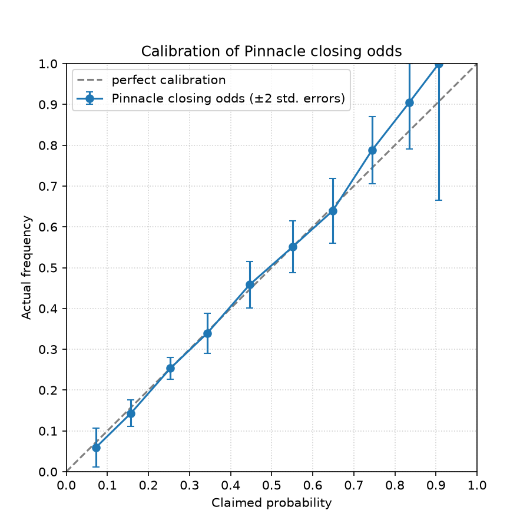

# Mispricing in sports prediction markets

## Question

Are prices on prediction markets such as Polymarket and Kalshi systematically wrong for soccer and other sports, and can media attention or large bets explain when they move away from fair value?

A market price is a probability. To test whether it is wrong, I need a benchmark for the true probability. I use Pinnacle closing odds, a sharp bookmaker line, after removing the bookmaker's margin.

## Status

Phase 1 is complete: testing whether the benchmark itself is reliable. Prediction market data is not included yet.

## What Phase 1 does

1. Loads three Premier League seasons (2023/24 to 2025/26) from football-data.co.uk.
2. Converts Pinnacle closing odds into fair probabilities: take 1 / odds for home, draw and away, then divide each by their sum so they total 100%. This removes the bookmaker's margin (proportional normalization).
3. Pools every outcome (three per match) and groups them by claimed probability in bins of width 0.1.
4. Compares the average claimed probability in each bin with how often the outcome actually happened, with two-standard-error bars.

## Result

Sample: 970 matches (2,910 outcomes), 11 August 2023 to 8 January 2026.



Pinnacle's closing probabilities matched actual frequencies closely across the range, and every gap was within two standard errors of zero. Low-probability outcomes happened slightly less often than claimed and high-probability outcomes slightly more often, which is the direction of the favorite-longshot bias, but the differences are inside the noise at this sample size.

                  n  avg_prob  actual    gap  noise
bin                                                
(-0.001, 0.1]   118     0.072   0.059  0.013  0.024
(0.1, 0.2]      510     0.157   0.143  0.014  0.016
(0.2, 0.3]     1062     0.253   0.253  0.000  0.013
(0.3, 0.4]      374     0.343   0.340  0.004  0.025
(0.4, 0.5]      301     0.447   0.458 -0.012  0.029
(0.5, 0.6]      243     0.552   0.551  0.000  0.032
(0.6, 0.7]      144     0.648   0.639  0.009  0.040
(0.7, 0.8]      113     0.744   0.788 -0.043  0.041
(0.8, 0.9]       42     0.835   0.905 -0.070  0.057
(0.9, 1.0]        3     0.907   1.000 -0.093  0.168

## Data note

The Pinnacle closing odds columns are empty for 170 matches in 2025/26, from 17 January 2026 to the end of the season, so those matches are excluded. The cause is not confirmed.

## Limitations

- 970 matches cannot detect small biases.
- Bins near 0 and 1 contain few outcomes, and the simple standard error formula is unreliable there.
- Proportional normalization is the simplest way to remove the margin. Other methods (power, Shin) treat longshots differently and could change results where the favorite-longshot bias would appear.
- Premier League only.

## Plan

1. Pull live Polymarket and Kalshi prices for soccer markets.
2. Log market price against the benchmark probability over weeks.
3. Run the same calibration test on the prediction market data.
4. Test whether news attention and large trades move prices away from fair value, and whether they revert.
5. Build an independent probability model (Elo or Poisson) and test out of sample.
6. Simulate trading with fees and spreads, then paper trade.

Pinnacle closed its public API in July 2025, so the live benchmark for later phases needs another source, such as Betfair Exchange prices.

## How to run

```
pip install -r requirements.txt
```

Create a `data/` folder and download the Premier League CSVs for 2023/24, 2024/25 and 2025/26 from football-data.co.uk, saving them as `pldata2324.csv`, `pldata2425.csv` and `pldata2526.csv`. Then:

```
python probability.py
```

This prints the calibration table and saves the chart to `results/calibration.png`.

## Structure

```
probability.py     data loading, margin removal, calibration table, chart
data/              raw CSVs (not included)
results/           output charts
requirements.txt
```

## Disclaimer

This is a research project. Nothing here is financial advice, and no strategy has been shown to be profitable.